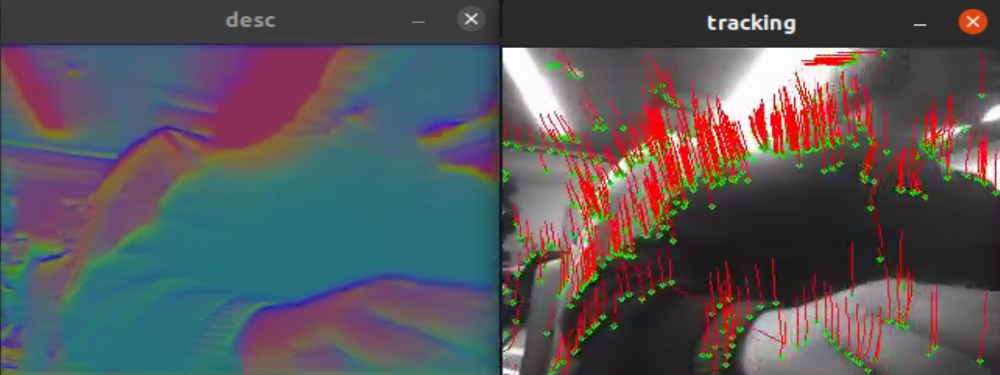

# LS-VINS: Light Feature Net Stereo VINS 

## 环境配置

- ncnn
- ros noetic
- realsense driver

**ncnn加速框架**
```bash
git clone https://github.com/Tencent/ncnn.git
cd ncnn

mkdir build && cd build && cmake .. && make

sudo make install

# 然后就能在 ncnn 的 build 目录里面看到编译完的 ncnn 组件了
```

## 使用
```bash
# 下载和编译
git clone https://github.com/Derkai52/LS-VINS.git
cd LS-VINS
catkin_make

# 将使用 RealSense D430 左目进行推理（realsense配置文件需要参考launch的路径自己写一下）
roslaunch letnet realsense_d430_run.launch

```

